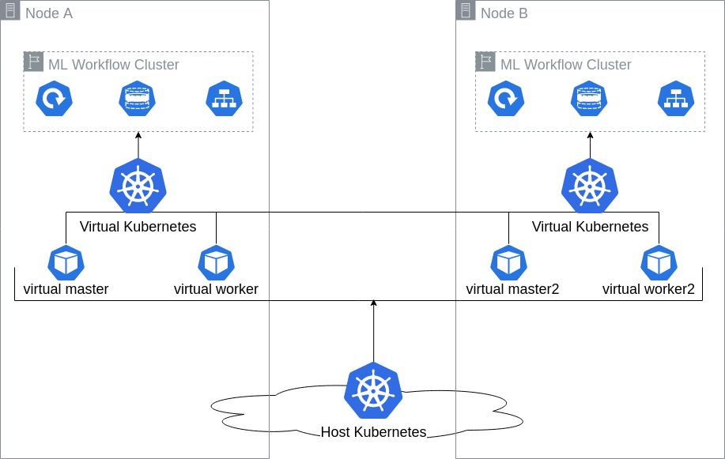

# Virtual Kubernetes(vk8s) Project
## Overview
제한된 노드환경에서는 쿠버네티스 클러스터를 많이 생성할 수 없고 클러스터를 삭제하기도 부담스러울 수 있습니다. 이를 보완하기 위해 쿠버네티스 클러스터들을 쿠버네티스로 관리하는, kubernetes-in-kubernetes(kink)를 구현했습니다. 호스트 쿠버네티스 위에서 생성되는 쿠버네티스를 가상 쿠버네티스(virtual kubernetes)라고 정의하고 있으며, 사용자가 필요로 할 때마다 virtual kubernetes를 생성하여 테스트 목적으로 사용하고 다 사용하면 virtual kubernetes만 삭제하는 방식으로 사용할 수 있습니다. 이로써 제한된 노드에서도 여러 개의 쿠버네티스 클러스터를 만들어 사용해볼 수 있습니다.
## KinK 구조
  
호스트 쿠버네티스가 여러 노드에 걸쳐서 떠 있고 그 위에 virtual 쿠버네티스들이 실행되는, 말 그대로 kubernetes-in-kubernetes 구조입니다.
## Requirements
1. linux kernel version >= 5.4 (recommended)
1. 호스트 쿠버네티스 설치
1. 호스트 도커 storage-driver가 overlay2이어야 함  
- 자세한 사항은 [Prerequisite](./prerequisite.md)를 참고해주세요
## QuickStart
**Master Node: node1; Worker Node: node2**
### Virtual Kubernetes 구축하기
1. Vk8s Component 설치
    ```bash
    # ./install.sh <image-registry> <ip-reservation-range>
    ./install.sh 10.40.103.111:15001 192.168.100.0/24 
    ```
1. Vk8s 리소스 생성
    ```bash
    kubectl apply -f config/samples/vk8s-1-20.yaml
    ```
    `Vk8s` 리소스를 생성하면 yaml 스펙에 맞게 자동으로 `statefulset`과 `service`가 생성되고 `virtual kubernetes`가 구축되기 시작하며, 네트워크 상태에 따라 수십분이 걸릴 수도 있습니다. 진행사항을 확인하시려면 `vk8s`리소스의 status나 `vk8s-controller-manager`파드 로그를 확인하시면 됩니다.
1. Vk8s Component 삭제
    ```bash
    ./uninstall.sh
    ```
## 프로젝트
### vk8s controller
vk8s Custom Resource 스펙과 Custom Resource에 대한 로직을 직접 수정하실 수 있습니다. 자세한 사항은 [vk8s](./vk8s/README.md)를 확인해주세요
### vnode
vnode(virtual node) Dockerfile, vk8s 스크립트 등 vnode 이미지 빌드와 관련된 파일이 있는 폴더 입니다. 자세한 사항은 [vnode](./vnode/README.md)를 확인해주세요.
### ip manager
calico static ip 할당을 위해, ippool과 할당 가능한 ip 등의 관리를 담당하는 서비스입니다. 자세한 사항은 [ip-manager](./ip-manager/README.md)를 확인해주세요.